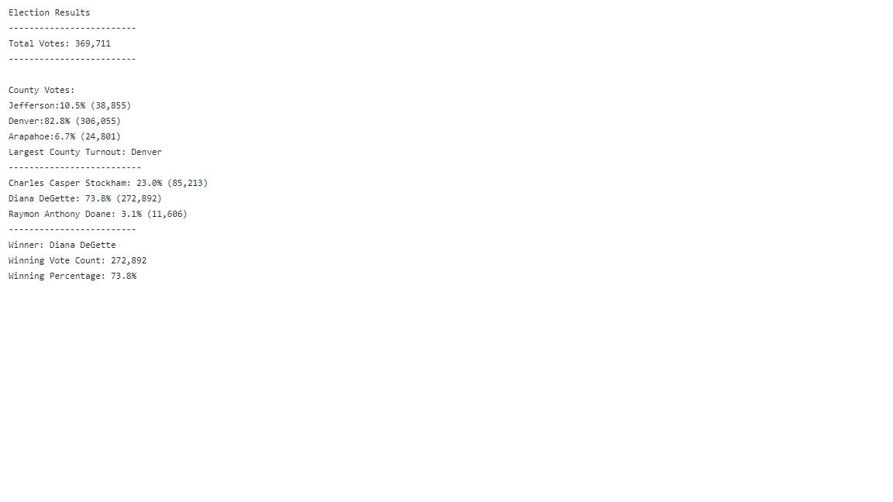
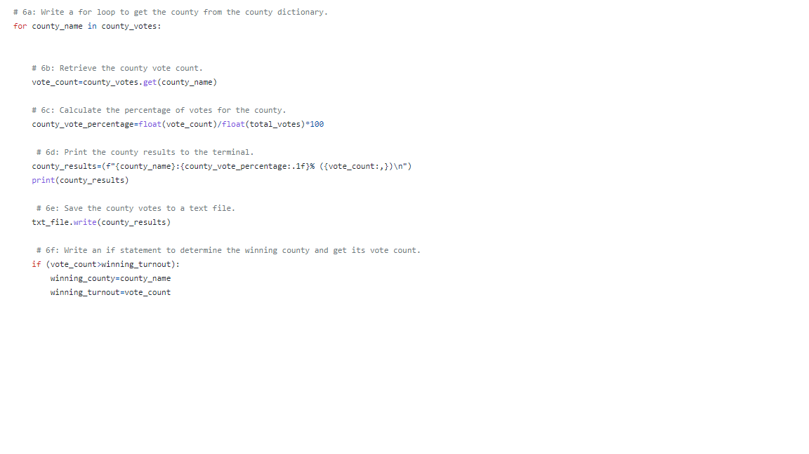

# Election-Analysis
## Overview of Election Audit
The Election Audit project is comprised of congressional election data for the Arapahoe, Denver, and Jefferson counties and utilizes analytics to understand the outcome and other datapoints of the election.

## Election-Audit Results

- **How many votes were cast in this congressional election?**

There were 369,711 total votes

- **Provide a breakdown of the number of votes and the percentage of total votes for each county in the precinct.**

Out of the ~370k votes, 82.8% derived from Denver county (306,055); 10.5% from Jefferson county (38,855); and 6.7% from Arapahoe county (24,801).

- **Which county had the largest number of votes?**

Denver had the largest number of votes. This was obtained using a for loop and if statement to extract the county with the most votes from the county dictionary defined in earlier part of the code.

- **Provide a breakdown of the number of votes and the percentage of the total votes each candidate received.**

The three candidates that ran their campaign during the election were Charles Casper Stockham, Diana DeGette, and Raymon Anthony Doane and received the following total votes and percentage of the election: 23% (85,213), 73.8% (272,892), and 3.1% (11,606), respectively.

- **Which candidate won the election, what was their vote count, and what was their percentage of the total votes?**

Diana DeGette won the election!

## Election-Audit Summary
For future elections this script to be modified to consider the population of each county to understand how proximity determines the fate of elections. Including this data could also project the influence of specific areas based on the number of people that actually live in those areas. Additionally, the script could include demographic information to further understand the diversity of the voters and the groups that voted for the candidates.
